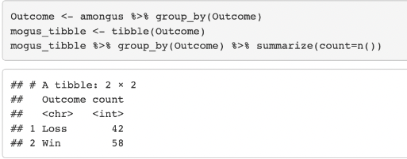
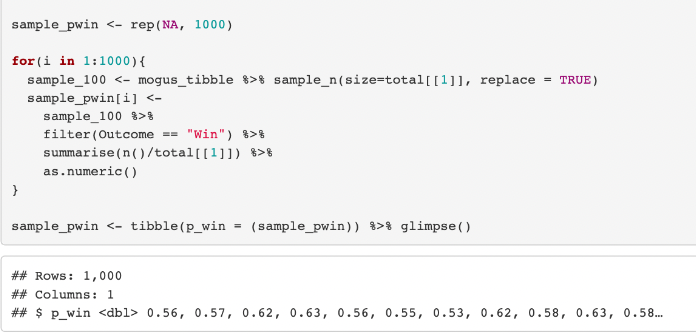
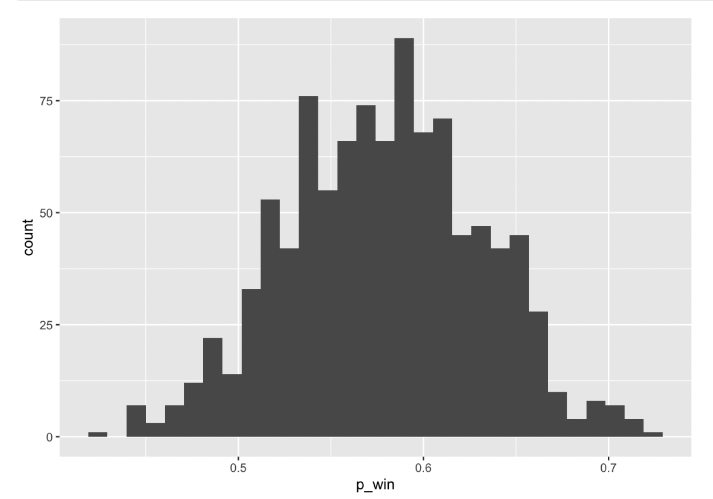
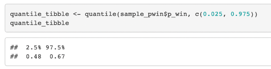

<h1> Among Us Predictive Modeling Report</h1>

This report uses a data set from Kaggle based on a user's experience from playing the Among Us game. Specifically, this report focuses on the number of times the user wins and losses each game. The language I used to analyze this data is R, which I like because I can use the tidy verse library to organize and visualize my data, and R has lots of built in functions to make sampling and prediction easy. I have used loops, sampling functions, tidy verse functions, and graphs to thoroughly analyze the data and create meaningly conclusions. For example, by the end of this report I will have calculated with a 95% confidence what the probability of winning the next game of Among Us for the user. As well, I will have created a visualization of the distribution of different probabilities to win a game of Among Us based on the data. 

Firstly, using functions from the tidy verse library, I retrieved the important values from the data that will help us analyze and make predictions, specifically the total number of games and the number of wins and losses.

Using the sample function to select random samples from the data and find similar probabilities for winning a game of Among Us based on the data

Estimating the sampling distribution of probability to win the next game of Among Us based on the data (wins/losses of previous games). The sampling distribution is the distribution of all values that the probability of winning a game could be for random samples from the data. To estimate the sampling distribution, I took 1000 values from the probability of winning and calculated 1000 randoms samples from the population (main data)

This is a histogram displaying the sampling distribution of the probability of winning a game of Among Us, which has a normal distribution. 

Also calculated the confidence interval of the sampling distribution, where I can estimate with a 95% confidence what the probability of winning the next game of Among Us. For this specific data set, the confidence interval is between 48% and 67%. This means that there is a 95% probability that the probability of winning the next game of Among Us is between 48% and 67%. 

